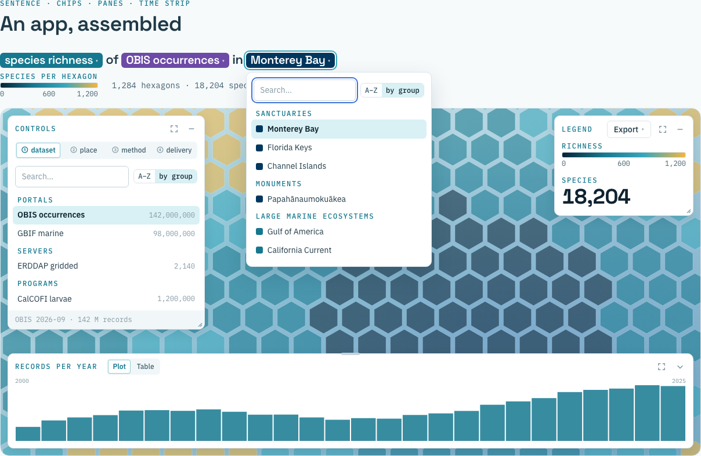

# @marinebon/ui

MBON UI kit: brand tokens and Svelte 5 components for MBON web apps.

- Demo: <https://marinebon.org/ui/> (every component in light and dark; `?theme=dark` forces dark)
- Brand: <https://marinebon.org/brand/v1/>. The tokens here copy the names in
  [marinebon.github.io `static/css/tokens/`](https://github.com/marinebon/marinebon.github.io/tree/main/static/css/tokens).
- For agents adding controls to an app: [AGENTS.md](AGENTS.md).



## Install

The package is installed from git; `dist/` is committed, so no build step runs on install.

```sh
npm i github:marinebon/ui#v0.1.0
```

```json
"dependencies": { "@marinebon/ui": "github:marinebon/ui#v0.1.0" }
```

Peer dependency: `svelte@^5`. No other runtime dependency.

## Use

```ts
// main.ts: once, at the app entry
import "@marinebon/ui/styles.css"; // fonts + tokens + base
import { initTheme } from "@marinebon/ui";
initTheme(); // ?theme= > stored choice > prefers-color-scheme
```

```svelte
<script lang="ts">
  import { Header, Footer, Pane, Picker } from "@marinebon/ui";
</script>
```

| import | what |
|---|---|
| `@marinebon/ui` | components, `theme` functions, types |
| `@marinebon/ui/styles.css` | `fonts.css` + `tokens.css` + `base.css` |
| `@marinebon/ui/tokens.css` | CSS custom properties only (light on `:root`, `[data-theme=dark]`, `[data-theme=light]`) |
| `@marinebon/ui/base.css` | element defaults, focus rings, `.mbon-label`, `.mbon-card`, `.mbon-sr-only` |
| `@marinebon/ui/fonts.css` | `@font-face` for the self-hosted woff2 (no Google Fonts request) |
| `@marinebon/ui/theme` | theme functions without the components |
| `@marinebon/ui/img/mbon-logo.png`, `mbon-logo-white.png` | the wordmark (cobalt on light; white on navy/abyss) |

To avoid a flash of the wrong theme, set `data-theme` before first paint (copy from
[`demo/index.html`](demo/index.html)):

```html
<script>
  (function () {
    var q = new URLSearchParams(location.search).get("theme"), s = null;
    try { s = localStorage.getItem("mbon-theme"); } catch (e) {}
    document.documentElement.dataset.theme = q === "dark" || q === "light" ? q
      : s === "dark" || s === "light" ? s
      : matchMedia("(prefers-color-scheme: dark)").matches ? "dark" : "light";
  })();
</script>
```

## Brand in one screen

| role | token | value |
|---|---|---|
| brand: buttons, logo | `--brand` / `--cobalt-500` (hover `--cobalt-600`) | `#2456b8` / `#1c44a0` |
| accent: links, active | `--accent` / `--teal-400`, `--link` / `--teal-600` | `#38a7bb` / `#15788f` |
| the ONE call to action | `--action` / `--coral-500` | `#f2683f` (dark ink text, keep it rare) |
| data highlight | `--sun-400` | `#f5b53f` |
| dark surfaces | `--navy-700`, `--abyss-800`, `--abyss-900` | `#01375f`, `#082336`, `#04131f` |
| text | `--ink-900` / `-700` / `-500` / `-300`, `--text-on-dark` | `#0f2230` … `#8499a3`, `#eaf3f7` |
| surfaces, borders | `--foam-50` page, `--foam-100` tint, `--white`, `--line-200` | `#f6fafb`, `#f1f7f9`, `#fff`, `#dbe5ea` |
| facets, in order | `--facet-place` `-method` `-org` `-type` `-portal` `-content` `-topic` | `#01375f` `#15788f` `#1a7a4e` `#b5651d` `#6d4aa7` `#a83b6f` `#44606e` |
| pipeline motif | `--pipe-dataset` `-place` `-method` `-delivery` | `#6d4aa7` `#01375f` `#15788f` `#f2683f` |

Type: Space Grotesk (`--font-display`) for titles and big numerals; IBM Plex Sans (`--font-sans`) for
body and UI; IBM Plex Mono (`--font-mono`) for data and the LABEL (`.mbon-label`: 12 px, uppercase,
0.14em, teal-600). Scale `--text-xs`…`--text-4xl` = 12·14·16·18·22·28·36·48·64 px.

Components use semantic aliases (`--bg-surface`, `--text-body`, `--border`, `--pane-bg`, …), so a
`data-theme="dark"` on any ancestor switches them. Cards: `.mbon-card` (white or `.mbon-card--tint`,
10 px radius, 1 px `line-200` border, a `.mbon-label` on top). Never an accent stripe on an edge,
never a line under a title.

## Components

Every bindable prop is marked `bind:`. All components are Svelte 5 (runes) and work with keyboard
and screen readers; see the comment at the top of each `.svelte` file for the full behaviour.

### Header

MBON wordmark (links to marinebon.org), app name, one-line tagline, a lens/mode word; on the right
a Help ▾ menu, a feedback slot and the theme toggle. `tone="navy"` uses the navy surface and the
white wordmark.

```svelte
<Header appName="ERDDAP places" tagline="gridded data summarised by place" appHref="./">
  {#snippet lens()}map{/snippet}
  {#snippet help(close)}
    <a href="#tour" onclick={close}>Take the tour</a>
    <a href="https://github.com/oceanmetrics/erddap-places">Source</a>
  {/snippet}
  {#snippet feedback()}<Button variant="quiet" size="sm" href="mailto:…">Feedback</Button>{/snippet}
</Header>
```

Props: `appName`, `tagline?`, `appHref?`, `logoHref` (`https://marinebon.org`), `tone` (`light`|`navy`),
`themeToggle` (true), `helpLabel` ("Help"); snippets `lens`, `help(close)`, `feedback`, `right`.

### Footer

Small and quiet: "built by Ocean Metrics", a release/data slot, a timing/bytes slot, a source link.

```svelte
<Footer sourceHref="https://github.com/oceanmetrics/obis-hex">
  {#snippet release()}OBIS 2026-09 · 142 M records{/snippet}
  {#snippet timing()}{ms} ms · {mb} MB{/snippet}
</Footer>
```

### ThemeToggle

The moon/sun button the Header uses; persists the choice.

```svelte
<ThemeToggle />
```

### Pane

A floating panel inside a positioned container (e.g. over a map). Drag the title bar (mouse, pen,
touch); double-click or <kbd>Home</kbd> sends it home; arrow keys move it when the title is
focused. Collapse docks a labelled pill to the nearest edge; expand fills the container and
<kbd>Esc</kbd> restores; resize from the right edge, bottom edge or corner grip (the grip takes arrow
keys). Position and size are remembered per viewport class (`phone`/`tablet`/`laptop`/`wide`) in
`localStorage` under `mbon-pane:<id>:<class>`. Below `sheetBelow` (640 px) panes in one container
stack as bottom sheets: one open, the rest as bars beneath it.

```svelte
<div style="position: relative; height: 100vh">
  <Map />
  <Pane title="legend" id="legend" anchor="top-right" width={260}
        bind:open={state.legend} bind:collapsed={state.legendMin} bind:expanded={state.legendMax}>
    {#snippet actions()}
      <Menu label="Export" align="end">
        {#snippet children(close)}<button onclick={() => { savePng(); close(); }}>PNG</button>{/snippet}
      </Menu>
    {/snippet}
    <Legend domain={[0, 1200]} title="richness" />
    {#snippet footer()}1,284 hexagons{/snippet}
  </Pane>
</div>
```

Props: `title`, `id?` (storage key), `bind:open`, `bind:collapsed`, `bind:expanded`, `anchor`
(`top-left`|`top-right`|`bottom-left`|`bottom-right`), `offset {x,y}`, `width` (320), `height?`
(default fits content), `minWidth`, `minHeight`, `margin` (12), `draggable`, `resizable`,
`collapsible`, `expandable`, `closable`, `pillLabel?`, `sheetBelow` (640), `onclose?`; snippets
`children`, `actions`, `footer`. Method: `home()`.

### Controls

A Pane with numbered tabs (① ② ③ ④). Tab labels and panels are slots; ← → Home End move between
tabs. Use the pipeline order: dataset → place → method → delivery.

```svelte
<Controls id="controls" bind:active={tab}
  tabs={[{ id: "dataset", label: "dataset" }, { id: "place", label: "place" },
         { id: "method", label: "method" }, { id: "delivery", label: "delivery" }]}>
  {#snippet panel(id)}
    {#if id === "place"}<Picker items={places} bind:value={place} label="places" />{/if}
  {/snippet}
  {#snippet footer()}{n} datasets · ERDDAP coastwatch{/snippet}
</Controls>
```

Props: `tabs`, `bind:active`, `numbered` (true), `onchange?`, and the Pane props (`title`, `id`,
`bind:open`, `bind:collapsed`, `bind:expanded`, `anchor`, `offset`, `width`, `height`); snippets
`panel(id)`, `tabLabel(tab, i)`, `footer`, `actions`.

### Sentence and Chip

The title as a sentence of plain words and Chips. A Chip opens a popover whose content is a slot,
normally the same Picker the Controls pane shows. <kbd>Esc</kbd> or a click outside closes it and
focus returns to the chip. The `sub` slot is the second line (colour scale, counts).

```svelte
<Sentence>
  <Chip label={metricLabel} facet="method" title="choose a metric">
    {#snippet children(close)}
      <Picker items={metrics} bind:value={metric} label="metrics" onselect={() => close()} />
    {/snippet}
  </Chip>
  in
  <Chip label={placeLabel} facet="place" title="choose a place">
    {#snippet children(close)}<Picker items={places} bind:value={place} label="places" onselect={() => close()} />{/snippet}
  </Chip>
  {#snippet sub()}<Legend domain={[0, 1200]} /> <span>1,284 hexagons</span>{/snippet}
</Sentence>
```

Sentence props: `level` (1), `size` (`md` 22 px, `lg` 28 px; one step smaller on phones); snippets `children`, `sub`.
A Chip renders at 0.9em of the sentence text.
Chip props: `label`, `facet` (`place`|`method`|`org`|`type`|`portal`|`content`|`topic`|`dataset`|`delivery`),
`bind:open`, `title` (popover name), `width` ("20rem"), `onopen?`, `onclose?`; snippet `children(close)`.

### Picker

A searchable list with optional groups, icons/swatches and counts. The search box is a combobox:
↑ ↓ PgUp PgDn move, Enter picks, Esc clears the search (a second Esc closes an enclosing Chip). "A–Z /
by group" switches between a flat sorted list and the given group order.

```svelte
<Picker
  items={[
    { id: "mbnms", label: "Monterey Bay", group: "Sanctuaries", color: "var(--facet-place)", count: 1284 },
    { id: "ccs", label: "California Current", group: "Large marine ecosystems", icon: "≈" },
  ]}
  bind:value={place} bind:mode label="places" onselect={(it) => go(it.id)} />
```

Props: `items: PickerItem[]` (`id`, `label`, `group?`, `icon?`, `color?`, `count?`, `keywords?`,
`disabled?`), `bind:value`, `bind:mode` (`az`|`group`), `label`, `showLabel`, `placeholder`,
`modeToggle?`, `maxHeight` ("18rem"), `emptyText`, `onselect?`; snippet `row(item)`.

### Menu

A small disclosure menu (Help ▾, Export ▾). Links and buttons inside get menu-row styling; ↑ ↓
Home End move, Esc closes and refocuses the trigger.

```svelte
<Menu label="Export" align="end">
  {#snippet children(close)}
    <button onclick={() => { csv(); close(); }}>CSV</button>
    <a href={permalink}>Link to this view</a>
  {/snippet}
</Menu>
```

Props: `label`, `bind:open`, `align` (`start`|`end`), `variant` (`quiet`|`plain`), `ariaLabel?`.

### Select

```svelte
<Select label="Resolution" bind:value={res}
  options={[{ value: "5", label: "H3 res 5", group: "coarse" }, { value: "7", label: "H3 res 7", group: "fine" }]} />
```

Props: `bind:value`, `options` (`value`, `label`, `group?`, `disabled?`), `label?`, `hideLabel`,
`disabled`, `onchange?`.

### Toggle

```svelte
<Toggle bind:checked={showSanctuaries} label="Sanctuary outlines" hint="NOAA ONMS" />
```

Props: `bind:checked`, `label`, `hint?`, `disabled`, `onchange?`. Renders `role="switch"`.

### Slider

```svelte
<Slider label="Year" bind:value={year} min={2000} max={2025} ticks={[2000, 2010, 2020]} />
<Slider label="Opacity" bind:value={op} min={0} max={1} step={0.1} format={(v) => `${v * 100}%`} buttons={false} />
```

Props: `bind:value`, `min`, `max`, `step`, `label`, `ticks` (numbers or `{value,label}`), `format`,
`buttons` (± step buttons, true), `disabled`, `oninput?`.

### Button

```svelte
<Button onclick={apply}>Apply</Button>               <!-- primary: cobalt -->
<Button variant="action" href={downloadUrl}>Download</Button>  <!-- the ONE coral CTA -->
<Button variant="quiet" pressed={on}>Hexagons</Button>
```

Props: `variant` (`primary`|`action`|`quiet`), `size` (`sm`|`md`), `href?`, `target?`, `pressed?`,
plus any `<button>` attribute.

### Notice

```svelte
<Notice kind="warn">ERDDAP is slow; showing cached tiles.</Notice>
<Notice kind="error" ondismiss={() => (err = null)}>{err}</Notice>
```

Props: `kind` (`info`|`warn`|`error`), `ondismiss?`. Errors use `role="alert"`, others `role="status"`.

### Legend

```svelte
<Legend title="species per hexagon" domain={[0, 1200]} ticks={[600]} colors={["#082336", "#15788f", "#38a7bb", "#f5b53f"]} />
<Legend type="categorical" title="realm" items={[{ label: "pelagic", color: "#15788f", count: 812 }]} onselect={(it) => …} />
```

Props: `type` (`continuous`|`categorical`), `title?`, `colors`, `domain`, `ticks`, `format`, `unit?`,
`items`, `onselect?`.

### PipelineChips

The MBON motif: dataset · place · method · delivery, in that order and colour.

```svelte
<PipelineChips values={{ dataset: "OBIS", place: "Monterey Bay", method: "richness", delivery: "map" }}
  active="place" onselect={(step) => (tab = step)} />
```

Props: `values`, `labels`, `active?`, `onselect?` (makes the chips buttons), `size` (`sm`|`md`).

### Stat

```svelte
<Stat value={18204} label="species" />
<Stat value="142 M" label="records" note="OBIS 2026-09" size="lg" />
```

Props: `value`, `label`, `unit?`, `note?` (string or snippet), `size` (`md`|`lg`), `format`.

### Kbd

```svelte
Press <Kbd>Esc</Kbd> to restore.
```

### TimeStrip

A bottom pane shell for a time chart. The chart is the app's: the slot receives the plot `width`
and `height`. The strip adds a title bar, a height grip, collapse, an Expand button, optional tabs
(for example Plot / Table), and a brush (drag to select, click to clear; ← → move, Shift+← → resize,
Esc clears; the brush works on the first tab, the plot). Callbacks get pixels (`x0`, `x1`), fractions of
the plot (`f0`, `f1`) and, with `domain`, values (`v0`, `v1`). On phones it joins the Panes'
bottom-sheet stack.

```svelte
<TimeStrip title="records per year" domain={[2000, 2026]} bind:brush plotLeft={32}
  onbrushend={(r) => setYears(Math.round(r.v0), Math.round(r.v1))} onclear={() => setYears(null)}>
  {#snippet children({ width, height })}<MyPlot {width} {height} />{/snippet}
</TimeStrip>
```

Tabs and Expand: pass `tabs` (2 or more `{id, label}`) and `bind:active`; the strip shows the same
segmented tabs as Controls in its header (← → Home End move, selected tab in accent) and you switch
the `children` content on `active`. `expandable` (true) adds an Expand button; `bind:expanded` makes
the strip fill its positioned container (<kbd>Esc</kbd> restores), and `height` is left alone so
restore returns to the previous height.

```svelte
<TimeStrip title="records per year" tabs={[{ id: "plot", label: "Plot" }, { id: "table", label: "Table" }]}
  bind:active={tab} bind:expanded>
  {#snippet children({ width, height })}
    {#if tab === "plot"}<MyPlot {width} {height} />{:else}<MyTable />{/if}
  {/snippet}
</TimeStrip>
```

Props: `title`, `bind:collapsed`, `bind:expanded` (false), `expandable` (true), `tabs?`, `bind:active?`,
`bind:height` (140), `minHeight`, `maxHeight`, `domain?`,
`plotLeft`, `plotRight`, `bind:brush` (`[f0, f1] | null`), `overlay` (true), `sheetBelow`,
`onbrush?`, `onbrushend?`, `onclear?`; snippets `children({width, height})`, `actions`.

### theme.ts

```ts
import { initTheme, readTheme, writeTheme, toggleTheme, clearTheme, onThemeChange } from "@marinebon/ui";
initTheme();                    // apply ?theme= > stored > system; follow system changes
writeTheme("dark");             // apply + persist (localStorage "mbon-theme")
writeTheme("light", { persist: false });
const off = onThemeChange((t) => map.setStyle(t === "dark" ? darkStyle : lightStyle));
```

Also `systemTheme()`, `urlTheme(search)`, `storedTheme()`, `currentTheme()`, `applyTheme(theme, el?)`.

## Develop

```sh
npm install
npm run dev          # demo at http://localhost:5173/ui/
npm test             # vitest + @testing-library/svelte (jsdom)
npm run check        # svelte-check
npm run package      # svelte-package -> dist/ (commit it) + publint
npm run build:demo   # demo -> demo-dist/ (GitHub Pages builds this)
npm run screenshots  # Playwright: screenshots/ at phone 390, laptop 1440, projector 1920, light and dark
```

Release: bump `version` in `package.json`, add a `NEWS.md` entry, `npm run package`, commit `dist/`,
tag `vX.Y.Z`, push the tag. Apps pin the tag in their `package.json`.

## License

MIT (code). Fonts: SIL Open Font License 1.1 (`dist/fonts/OFL-*.txt`). The MBON wordmark identifies
MBON products only. Built by [Ocean Metrics](https://oceanmetrics.io) for the
[Marine Biodiversity Observation Network](https://marinebon.org).
